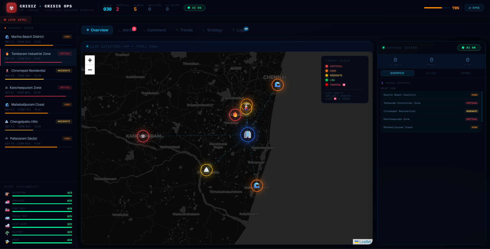

# 🚨 Crisis Operations Center — Tamil Nadu

A real-time AI-powered disaster response and coordination platform built for Tamil Nadu, India. Monitors active crisis zones, auto-dispatches emergency units, tracks trapped civilians via Firebase, and generates live operational strategy using Groq LLM.



---

## Features

**Live Crisis Map**
- Interactive Leaflet map centered on Tamil Nadu with animated vehicle dispatch routes
- Real-time severity overlays for 7 crisis zones across the region
- Trapped person markers fed from Firebase — operators click Rescue to dispatch a unit directly from the map
- SOS pulse animations, vehicle travel animations HQ → zone → HQ

**AI Dispatch Engine**
- Auto-dispatches the right vehicle type based on hazard (flood → coast guard, wildfire → fire truck, disease → ambulance etc.)
- Fleet availability tracking — cannot over-dispatch beyond real unit counts
- 60-second cooldown per zone after dispatch to prevent spam
- Cancel any AI dispatch mid-mission and return the unit to the pool
- Full dispatch log with ETA, status (en route / on scene / returning), and AI reasoning

**Real-World Data Feeds**
- **USGS Earthquake API** — M2.5+ earthquakes within 50–80km of each zone, severity scaled by magnitude²/distance
- **OpenWeatherMap** — live rainfall, wind speed, and temperature mapped to flood/wildfire/hurricane severity deltas
- **GDACS RSS** — active global disaster alerts filtered to Tamil Nadu region
- **IMD RSMC** — Bay of Bengal cyclone bulletins for coastal zones
- 60-second cache prevents rate-limit abuse; falls back to slow mean-reverting drift when no events are active

**Groq LLM Strategy**
- Generates a structured operational action plan covering every active zone by name
- Sections: Priority Commands, Resource Directives, Evacuation & Civil Control, Risk Monitoring
- Regenerates automatically when threat levels change; manual regenerate button available
- Uses `llama-3.3-70b-versatile` via Groq for fast, structured output

**Agent Pipeline** (runs every 30 seconds)
```
Real APIs → Cascade Effects → Confidence Scoring → Priority Ranking → Threat Labels → Resource Allocation → Forecast → Alerts → Strategy
```

**Other Panels**
- Alerts tab — zone-level alert cards with recommended actions and dispatch buttons
- Trends tab — 6-hour severity and infrastructure forecast with simulation sliders
- Logs tab — full chronological event log (dispatches, arrivals, escalations, returns)
- Fleet sidebar — live vehicle availability bars (green → yellow → red as units deplete)

---

## Tech Stack

| Layer | Tech |
|-------|------|
| Frontend | React 18, Vite, Leaflet, IBM Plex Mono |
| Backend | FastAPI, Python 3.12, asyncio |
| AI | Groq API (`llama-3.3-70b-versatile`) |
| Realtime DB | Firebase Realtime Database (trapped persons) |
| Data Feeds | USGS, OpenWeatherMap, GDACS, IMD RSMC |
| Styling | Custom CSS, no UI framework |

---

## Project Structure

```
crisis-agent/
├── frontend/
│   ├── src/
│   │   ├── App.jsx              # Root — state, tabs, layout
│   │   ├── components/
│   │   │   ├── CrisisMap.jsx    # Leaflet map + Firebase trapped persons
│   │   │   ├── CommandCenter.jsx # AI dispatch panel + fleet control
│   │   │   ├── Sidebar.jsx      # Zone list with live data badges
│   │   │   ├── AlertsTab.jsx    # Alert cards
│   │   │   ├── TrendsTab.jsx    # Forecast charts
│   │   │   ├── LogsTab.jsx      # Event log
│   │   │   ├── Dashboard.jsx    # Stats overview
│   │   │   └── StrategyTab.jsx  # Groq strategy display
│   │   ├── hooks/
│   │   │   ├── useDispatch.js   # Fleet tracking, AI auto-dispatch loop
│   │   │   └── useAgentState.js # Backend polling
│   │   └── DispatchEngine.js    # Vehicle types, HQ coords, hazard mappings
│   └── package.json
│
└── backend/
    ├── main.py                  # FastAPI app, agent loop, endpoints
    ├── models.py                # Pydantic models (Zone, Shelter, ResourcePool...)
    ├── agent/
    │   ├── data_ingester.py     # USGS + OWM + GDACS + IMD data feeds
    │   ├── grok_strategy.py     # Groq LLM strategy generation
    │   ├── scoring.py           # Priority scoring formula
    │   ├── verification.py      # Confidence scoring
    │   ├── cascade.py           # Secondary disaster effect chains
    │   ├── allocation.py        # Rules-based resource allocation
    │   ├── forecasting.py       # 6-hour severity forecast
    │   └── alerts.py            # Alert message generation
    └── requirements.txt
```

---

## Getting Started

### Prerequisites
- Python 3.12+
- Node.js 18+
- A [Groq API key](https://console.groq.com) (free)
- An [OpenWeatherMap API key](https://openweathermap.org/api) (free tier, 60 calls/min) — note: new keys take up to 10 hours to activate
- A Firebase project with Realtime Database enabled

### Backend Setup

```bash
cd backend
python -m venv venv
venv\Scripts\activate       # Windows
# source venv/bin/activate  # macOS/Linux
pip install -r requirements.txt
```

Create `backend/.env`:
```env
GROQ_API_KEY=your_groq_key_here
OWM_API_KEY=your_openweathermap_key_here
```

Start the server:
```bash
uvicorn main:app --reload --port 8000
```

### Frontend Setup

```bash
cd frontend
npm install
npm run dev
```

Create `frontend/.env.local`:
```env
VITE_FIREBASE_API_KEY=your_firebase_key
VITE_FIREBASE_AUTH_DOMAIN=your_project.firebaseapp.com
VITE_FIREBASE_DATABASE_URL=https://your_project-default-rtdb.firebaseio.com
VITE_FIREBASE_PROJECT_ID=your_project_id
```

The app runs at `http://localhost:5173` and connects to the backend at `http://localhost:8000`.

---

## API Endpoints

| Method | Endpoint | Description |
|--------|----------|-------------|
| GET | `/state` | Full agent state — zones, alerts, forecast, resources |
| GET | `/strategy` | Current Groq-generated strategy text |
| GET | `/data-feeds` | Debug — raw output from each data source |
| GET | `/health` | Backend health check |
| POST | `/strategy/regenerate` | Force a fresh Groq strategy call |
| POST | `/dispatch` | Manual dispatch override |

---

## How the Priority Formula Works

```
Priority = (Human Risk × 0.40) + (Supply Urgency × 0.20) + (Infrastructure Risk × 0.20) - (Accessibility × 0.20)

Human Risk = (Severity/10 × 0.50) + (Medical Urgency × 0.30) + (Population Factor × 0.20)

Confidence = (Source Reliability × 0.40) + (Cross Validation × 0.30) + (Time Freshness × 0.20) + (Data Consistency × 0.10)

Threat Label = Priority × (Confidence/100)
  > 0.50 → CRITICAL
  > 0.32 → HIGH
  > 0.16 → MODERATE
  else   → LOW
```

Source reliability weights: Satellite 0.95 · Agency 0.90 · Sensor 0.85 · Citizen 0.55

---

## Live Data Behaviour

When external APIs are active, zone severity is driven by real-world events. When no events are detected, zones use a slow mean-reverting drift (±0.12 max) to keep the UI dynamic without looking fake. Zones receiving live data show a `🛰 LIVE` badge in the sidebar.

| Source | What it detects | Free |
|--------|----------------|------|
| USGS Earthquake API | M2.5+ quakes within zone radius | ✅ No key needed |
| OpenWeatherMap | Rainfall, wind, temperature | ✅ Free tier |
| GDACS RSS | Active global disaster alerts | ✅ No key needed |
| IMD RSMC | Bay of Bengal cyclone warnings | ✅ No key needed |

---

## Zones

| ID | Name | Hazard | Population at Risk |
|----|------|--------|-------------------|
| Z-01 | Marina Beach District | Flood | 45,000 |
| Z-02 | Tambaram Industrial Zone | Wildfire | 28,000 |
| Z-03 | Chromepet Residential | Earthquake | 62,000 |
| Z-04 | Kancheepuram Zone | Disease Outbreak | 35,000 |
| Z-05 | Mahabalipuram Coast | Flood | 18,000 |
| Z-06 | Chengalpattu Hills | Landslide | 12,000 |
| Z-07 | Pallavaram Sector | Hurricane | 41,000 |

---

## Environment Variables Reference

| Variable | Where | Required | Description |
|----------|-------|----------|-------------|
| `GROQ_API_KEY` | backend/.env | Yes | Groq LLM API key |
| `OWM_API_KEY` | backend/.env | Recommended | OpenWeatherMap key |
| `VITE_FIREBASE_API_KEY` | frontend/.env.local | Yes | Firebase config |
| `VITE_FIREBASE_AUTH_DOMAIN` | frontend/.env.local | Yes | Firebase config |
| `VITE_FIREBASE_DATABASE_URL` | frontend/.env.local | Yes | Firebase Realtime DB URL |
| `VITE_FIREBASE_PROJECT_ID` | frontend/.env.local | Yes | Firebase project ID |

---

## Contributing

Pull requests welcome. If you're adapting this for a different region, the key files to update are:

- `backend/main.py` — `INITIAL_ZONES_DATA` array with your zones
- `backend/agent/data_ingester.py` — `ZONE_GEO` dict with coordinates and hazard sensitivities
- `frontend/src/DispatchEngine.js` — `HQ` coordinates and `VEHICLE_TYPES`

---

## License

MIT
